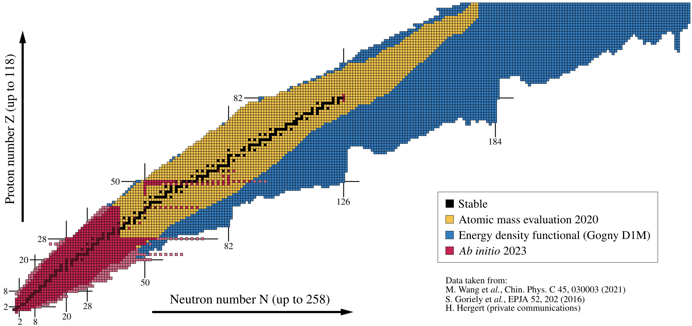
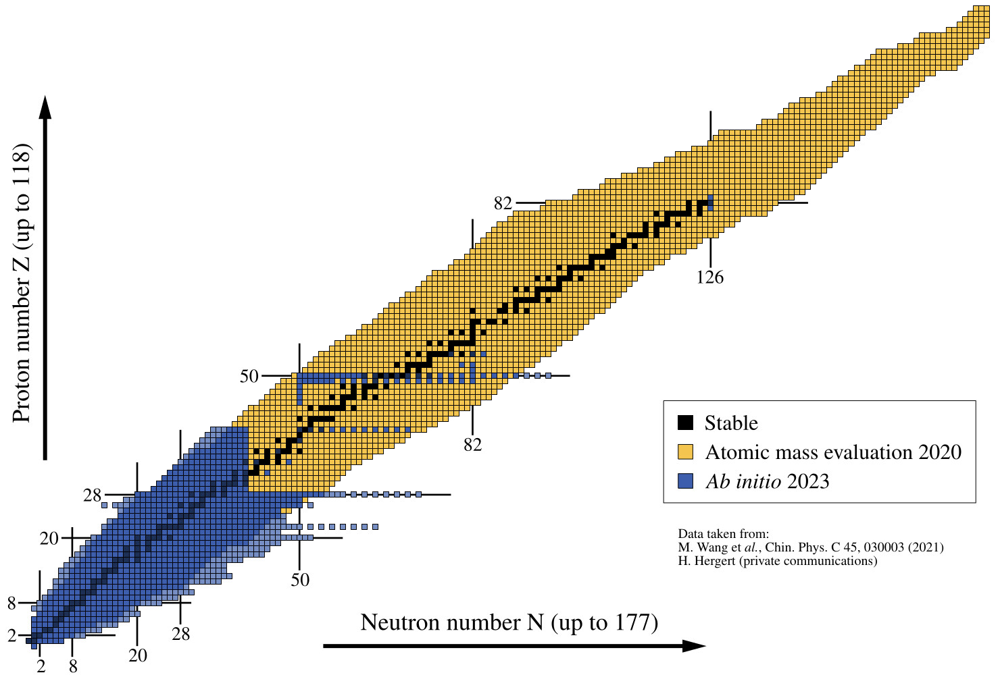

Inspired by others (e.g. [Hergert, Front. Phys. 8, 379 (2020)](https://doi.org/10.3389/fphy.2020.00379)), a few years ago I created a set of nuclear charts to represent
the progress in *ab initio* calculations of atomic nuclei over the years. You can find two examples below.

A few comments:
- The experimental data are taken from the latest Atomic Mass Evaluation (AME) available: [M. Wang et al., Chinese Phys. C 45 030003 (2021)](https://doi.org/10.1088/1674-1137/abddaf).
- The data regarding energy density functional (EDF) calculations have been obtained from S. Hilaire (CEA Bruyères-le-Châtel).
- For *ab initio* methods, I do not apply strict criteria. I consider all nuclei for which a *reasonable* calculation has been performed.

{:.lead width="800" loading="lazy"}
Comparison between data of the Atomic Mass Evaluation of 2020, nuclei predicted to exist by the Gogny D1M energy density functional and *ab initio* calculations
as of 2023.
{:.figcaption}

{:.lead width="800" loading="lazy"}
Comparison between data of the Atomic Mass Evaluation of 2020 and *ab initio* calculations as of 2023.
{:.figcaption}

You can download the PDF of the latest version of the nuclear charts here:  
(if you use them, please remember to cite me)
- [AME2020 vs EDF vs abinitio 2023](assets/pdf/nuclearchart_ame_edf_abinitio_2023_29112023.pdf)
- [AME2020 vs abinitio 2023](assets/pdf/nuclearchart_ame_abinitio_2023_29112023.pdf)  

<!-- 
Add chart deformation?

## Progress in *ab initio* methods 
## Links
In addition, here are the links to some useful online interactive nuclear charts:
- International Atomic Energy Agency (IAEA): [Live Chart of Nuclei](https://www-nds.iaea.org/relnsd/vcharthtml/VChartHTML.html)
- National Nuclear Data Center (NNDC): [NuDat 3.0](https://www.nndc.bnl.gov/nudat3/)
- Commissariat à l'Energie Atomique (CEA): [AMEDEE](https://www-phynu.cea.fr/science_en_ligne/carte_potentiels_microscopiques/carte_potentiel_nucleaire_eng.htm)
-->
